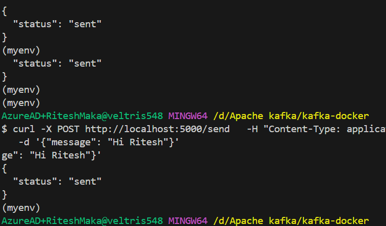
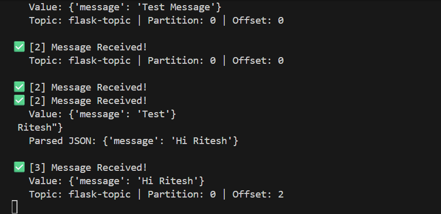
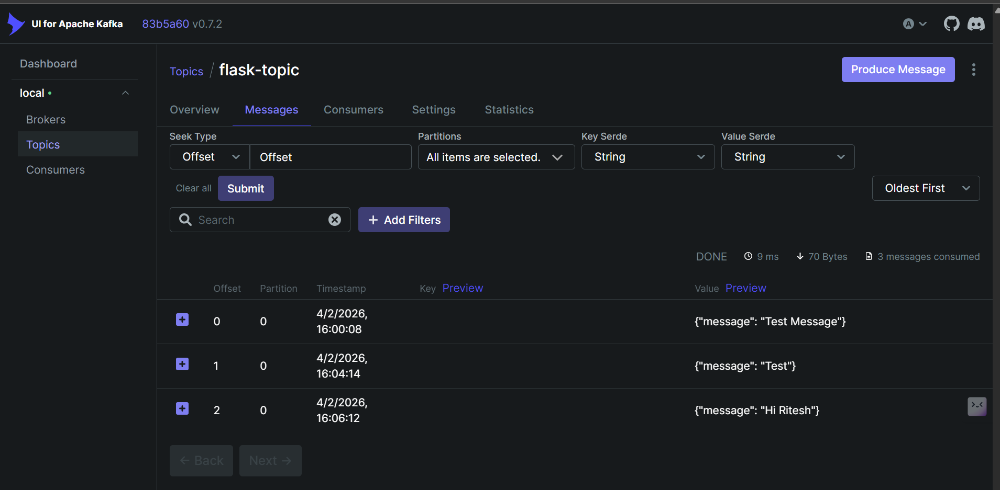
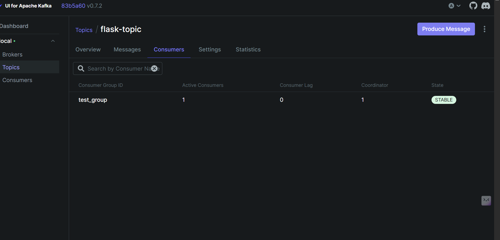

# Flask + Apache Kafka Integration 🚀

A complete example of integrating **Apache Kafka** with a **Flask web application** using Docker. This project demonstrates how to send messages from a Flask API and consume them using a Kafka consumer.

## 📋 Table of Contents

- [Architecture](#architecture)
- [Prerequisites](#prerequisites)
- [Installation & Setup](#installation--setup)
- [Running the Application](#running-the-application)
- [How It Works](#how-it-works)
- [API Endpoints](#api-endpoints)
- [Monitoring with Kafka UI](#monitoring-with-kafka-ui)
- [Common Issues & Solutions](#common-issues--solutions)
- [Project Structure](#project-structure)

---

## 🏗️ Architecture

```
┌─────────────┐         ┌──────────────┐         ┌──────────────┐
│   Flask     │         │    Kafka     │         │   Kafka UI   │
│ Application │────────▶│   Broker     │◀────────│  (Monitor)   │
│ (Producer)  │ HTTP    │  (Docker)    │ gRPC    │   Port 8080  │
└─────────────┘         └──────────────┘         └──────────────┘
                               ▲
                               │
                               ▼
                        ┌──────────────┐
                        │   Kafka      │
                        │  Consumer    │
                        │  (Python)    │
                        └──────────────┘
```

**Flow:**
1. Flask app receives HTTP POST request with a message
2. Producer sends message to Kafka topic `flask-topic`
3. Kafka Consumer (running separately) consumes messages from the topic
4. Kafka UI monitors topics, consumer groups, and messages in real-time

---

## 📁 Folder Structure

```
APACHE KAFKA/
│
├── flask-application/
│   ├── __pycache__/
│   ├── myenv/                    (Virtual environment)
│   ├── app.py                    (Flask HTTP endpoint)
│   ├── kafka_consumer.py         (Consumer logic)
│   ├── kafka_producer.py         (Producer logic)
│   └── requirements.txt
│
├── kafka-docker/
│   ├── docker-compose.yml        (Kafka + Zookeeper + UI)
│   └── notes.txt
│
└── README.md                     (This file)
```

---

## 📦 Prerequisites

* **Docker >= 20.x** - For running Kafka, Zookeeper, and UI
* **Docker Compose v2** - For orchestrating containers
* **Python 3.8+** - For Flask and Kafka client
* **pip** - Python package manager
* **curl** or **Postman** - For testing API endpoints

**Port availability:**
  * `2181` (Zookeeper)
  * `9092` (Kafka – host access)
  * `8080` (Kafka UI)

---

## 🔧 Installation & Setup

### 1. Navigate to Project Directory

```bash
cd d:\Apache\ kafka
```

### 2. Create Virtual Environment (Recommended)

```bash
# Windows
python -m venv flask-application/myenv
flask-application/myenv/Scripts/activate

# Linux/Mac
python3 -m venv flask-application/myenv
source flask-application/myenv/bin/activate
```

### 3. Install Python Dependencies

```bash
pip install -r flask-application/requirements.txt
```

**Dependencies:**
- `flask` - Web framework for HTTP endpoint
- `kafka-python` - Apache Kafka client for Python

### 4. Start Kafka & Zookeeper with Docker

```bash
cd kafka-docker
docker-compose up -d
```

**Verify containers are running:**
```bash
docker-compose ps
```

**Expected output:**
```
NAME       IMAGE                      STATUS
zookeeper  confluentinc/cp-zookeeper  Up
kafka      confluentinc/cp-kafka      Up
kafka-ui   provectuslabs/kafka-ui     Up
```

### 5. Access Kafka UI

Open your browser:
```
http://localhost:8080
```

You should see the Kafka cluster dashboard with no topics yet.

---

## ▶️ Running the Application

### Terminal 1: Start Kafka Consumer

```bash
cd flask-application
python kafka_consumer.py
```

**Expected output:**
```
🔌 Testing Kafka connection at localhost:9092...

✅ Kafka cluster found: ClusterMetadata(...)

✅ Successfully connected to Kafka!
📋 Subscribed to topic: flask-topic
👥 Consumer group: test_group
📚 Available topics: {'flask-topic'}
⏳ Waiting for messages... (This will show NEW messages sent after consumer starts)
```

**⚠️ Keep this terminal open!** Messages will appear here as they arrive.

---

### Terminal 2: Start Flask Application

```bash
cd flask-application
python app.py
```

**Expected output:**
```
 * Debugger is active!
 * Debugger PIN: 813-202-454
 * Running on http://127.0.0.1:5000
 * Press CTRL+C to quit
```

Flask is now ready to receive HTTP requests.

---

### Terminal 3: Send Test Messages

```bash
# Message 1
curl -X POST http://localhost:5000/send \
  -H "Content-Type: application/json" \
  -d '{"message": "Hello Kafka!", "user": "Alice"}'

# Message 2
curl -X POST http://localhost:5000/send \
  -H "Content-Type: application/json" \
  -d '{"message": "This is working!", "user": "Bob"}'
```

---

## ✅ What You Should See

### In Flask Terminal (Terminal 2):
```
127.0.0.1 - - [04/Feb/2026 15:50:35] "POST /send HTTP/1.1" 200 -
```

### In Consumer Terminal (Terminal 1):
```
✅ [1] Message Received!
   Value: {'message': 'Hello Kafka!', 'user': 'Alice'}
   Topic: flask-topic | Partition: 0 | Offset: 0

✅ [2] Message Received!
   Value: {'message': 'This is working!', 'user': 'Bob'}
   Topic: flask-topic | Partition: 0 | Offset: 1
```

### In Kafka UI (http://localhost:8080):
1. Go to **Topics** → **flask-topic** → Messages
2. You'll see all messages with their content
3. Go to **Consumers** → **test_group**
4. You'll see the consumer group with lag info

---

## 📊 How It Works

### 1. **Flask Application** (`app.py`)

Provides HTTP endpoint for sending messages:

```python
from flask import Flask, request, jsonify
from kafka_producer import send_to_kafka

app = Flask(__name__)

@app.route('/send', methods=['POST'])
def send_message():
    data = request.json
    if not data:    
        return jsonify({"error": "Missing JSON"}), 400

    send_to_kafka('flask-topic', data)
    return jsonify({"status": "sent"}), 200

if __name__ == '__main__':
    app.run(debug=True)
```

### 2. **Kafka Producer** (`kafka_producer.py`)

Sends messages to Kafka broker:

```python
from kafka import KafkaProducer
import json

producer = KafkaProducer(
    bootstrap_servers='localhost:9092',
    value_serializer=lambda v: json.dumps(v).encode('utf-8'),
    acks='all',  # Wait for all replicas
    retries=3,
    max_in_flight_requests_per_connection=1
)

def send_to_kafka(topic, data):
    try:
        future = producer.send(topic, data)
        record_metadata = future.get(timeout=10)
        
        print(f"✅ Message sent to {record_metadata.topic} "
              f"partition {record_metadata.partition} "
              f"offset {record_metadata.offset}")
        
        producer.flush()
        return True
    except Exception as e:
        print(f"❌ Failed to send message: {e}")
        return False
```

### 3. **Kafka Consumer** (`kafka_consumer.py`)

Subscribes to and consumes messages:

```python
consumer = KafkaConsumer(
    'flask-topic',
    bootstrap_servers=['localhost:9092'],
    group_id='test_group',  # Consumer group name
    auto_offset_reset='earliest',  # Start from beginning
    enable_auto_commit=True,
    value_deserializer=lambda x: json.loads(x.decode('utf-8'))
)

for message in consumer:
    print(f"✅ Message Received: {message.value}")
```

---

## 🌐 API Endpoints

### POST `/send` - Send a Message to Kafka

**Endpoint:** `http://localhost:5000/send`

**Request:**
```bash
curl -X POST http://localhost:5000/send \
  -H "Content-Type: application/json" \
  -d '{"message": "Your message", "user": "Name"}'
```

**Response (Success):**
```json
{
  "status": "sent"
}
```
**Status Code:** `200 OK`

**Response (Error):**
```json
{
  "error": "Missing JSON"
}
```
**Status Code:** `400 Bad Request`

---

## 📊 Monitoring with Kafka UI

### View Topics

1. Open http://localhost:8080
2. Click **Topics** in sidebar
3. Click **flask-topic**
4. View:
   - **Messages** - All messages in topic
   - **Partitions** - Data distribution
   - **Details** - Replication info

### View Consumer Groups

1. Open http://localhost:8080
2. Click **Consumers** in sidebar
3. Click **test_group**
4. View:
   - **Members** - Active consumer instances
   - **Topics** - Subscribed topics
   - **Lag** - Offset lag (should be 0)

### Produce Test Message via UI

1. Go to **Topics** → **flask-topic**
2. Click **Produce Message**
3. Enter JSON: `{"test": "message"}`
4. See it appear in consumer logs

---

## 🐛 Common Issues & Solutions

### ❌ Issue 1: Consumer Group Not Appearing in Kafka UI

**Symptoms:**
- Consumer script runs but doesn't show in UI
- Error: "No active consumer groups found"

**Root Cause:**
- Incorrect Docker listener configuration
- Consumer can't connect to group coordinator

**Solution:**

Verify `kafka-docker/docker-compose.yml`:

```yaml
environment:
  KAFKA_ADVERTISED_LISTENERS: PLAINTEXT://kafka:29092,PLAINTEXT_HOST://127.0.0.1:9092
  KAFKA_OFFSETS_TOPIC_REPLICATION_FACTOR: 1
```

Then restart:
```bash
cd kafka-docker
docker-compose down
docker-compose up -d
```

---

### ❌ Issue 2: "The coordinator is not available" Error

**Symptoms:**
```
DEBUG:kafka.coordinator:Received group coordinator response FindCoordinatorResponse_v2(
...error_code=15, error_message='The coordinator is not available.'
```

**Root Cause:**
- Kafka broker configuration incomplete
- Group topic not created

**Solution:**

Ensure these are in docker-compose.yml:
```yaml
KAFKA_OFFSETS_TOPIC_REPLICATION_FACTOR: 1
KAFKA_AUTO_CREATE_TOPICS_ENABLE: 'true'
```

Restart containers:
```bash
docker-compose down -v
docker-compose up -d
```

---

### ❌ Issue 3: Messages Not Appearing in Consumer Logs

**Symptoms:**
- Consumer is running and connected
- No messages appear when sending via curl

**Solutions:**

**A) Messages Only Appear AFTER Consumer Starts**
- Consumer uses `auto_offset_reset='earliest'` but only processes NEW messages
- Restart consumer first, then send messages

**B) Check Messages in Kafka UI**
1. Go to http://localhost:8080 → Topics → flask-topic
2. Verify messages exist in Kafka
3. If yes, but not in consumer, there's a deserialization issue

**C) Enable Debug Output**
The consumer script includes detailed error logging:
```
   Raw value (string): {"message": "test"}
   Parsed JSON: {'message': 'test'}
```

If you see "Deserialization error", check that producer sends valid JSON.

---

### ❌ Issue 4: Port Already in Use

**Error:**
```
Error starting userland proxy: listen tcp 0.0.0.0:9092: bind: An attempt was made to use a port in an exclusive state.
```

**Solution:**

```bash
# Windows - Find and kill process
netstat -ano | findstr :9092
taskkill /PID <PID> /F

# Or change port in docker-compose.yml
ports:
  - "9093:9092"  # Use 9093 instead
```

---

### ❌ Issue 5: Docker Containers Not Starting

**Check status:**
```bash
docker-compose ps
```

**View logs:**
```bash
docker-compose logs kafka
```

**Restart:**
```bash
docker-compose down
docker-compose up -d
```

---

## 🔧 Configuration Reference

### Kafka Producer Settings

| Parameter | Value | Purpose |
|-----------|-------|---------|
| `bootstrap_servers` | `localhost:9092` | Broker address |
| `acks` | `'all'` | Wait for all replicas |
| `retries` | `3` | Retry failed sends |
| `max_in_flight_requests_per_connection` | `1` | Ensure ordering |
| `value_serializer` | `json.dumps(...).encode()` | Convert to JSON bytes |

### Kafka Consumer Settings

| Parameter | Value | Purpose |
|-----------|-------|---------|
| `bootstrap_servers` | `['localhost:9092']` | Broker address |
| `group_id` | `'test_group'` | Consumer group |
| `auto_offset_reset` | `'earliest'` | Start from beginning |
| `enable_auto_commit` | `True` | Auto-commit offsets |
| `auto_commit_interval_ms` | `5000` | Commit every 5s |
| `value_deserializer` | `json.loads(...).decode()` | Parse JSON from bytes |

### Docker Compose Environment

| Variable | Value | Purpose |
|----------|-------|---------|
| `KAFKA_ADVERTISED_LISTENERS` | `PLAINTEXT://kafka:29092,PLAINTEXT_HOST://127.0.0.1:9092` | Broker addresses |
| `KAFKA_OFFSETS_TOPIC_REPLICATION_FACTOR` | `1` | Group offset storage |
| `KAFKA_AUTO_CREATE_TOPICS_ENABLE` | `'true'` | Auto-create topics |

---

## 🔍 Troubleshooting Checklist

Before debugging, verify:

- [ ] Docker containers are running: `docker-compose ps`
- [ ] Kafka UI is accessible: http://localhost:8080
- [ ] Consumer script is actively running
- [ ] Flask app is running: http://localhost:5000
- [ ] Topic name is `flask-topic` (both producer and consumer)
- [ ] Messages appear in Kafka UI (if not, check producer)
- [ ] Consumer group appears in Kafka UI (if not, check consumer connection)
- [ ] Python virtual environment is activated

---

## 📝 What Was Fixed

This project solved several common Kafka integration issues:

### ✅ Topic Name Mismatch
**Problem:** Producer sent to `flask-topic` but consumer listened to `test_topic`  
**Solution:** Both now use `flask-topic`

### ✅ Consumer Group Not Registering  
**Problem:** Docker listener config prevented group creation  
**Solution:** Fixed `KAFKA_ADVERTISED_LISTENERS` to use `127.0.0.1` instead of `localhost`

### ✅ JSON Deserialization Failures
**Problem:** Consumer received raw bytes instead of parsed JSON  
**Solution:** Added proper deserializer with error handling

### ✅ Coordinator Not Available Error
**Problem:** Kafka broker missing group configuration  
**Solution:** Added `KAFKA_OFFSETS_TOPIC_REPLICATION_FACTOR: 1`

---

## 🚀 Next Steps

### Add Features:
- [ ] Multiple consumer groups for different processing
- [ ] Message filtering and routing
- [ ] Error handling & dead letter queues
- [ ] Database persistence (PostgreSQL/MongoDB)
- [ ] Admin UI for message management

### Production Readiness:
- [ ] Use environment variables for all configs
- [ ] Implement structured logging (ELK stack)
- [ ] Add unit & integration tests
- [ ] Configure Kafka for HA (3+ brokers)
- [ ] Implement message schemas (Avro/Protobuf)

---

## 📚 Resources

- [Apache Kafka Documentation](https://kafka.apache.org/documentation/)
- [kafka-python Library](https://kafka-python.readthedocs.io/)
- [Flask Documentation](https://flask.palletsprojects.com/)
- [Confluent Kafka Docker Images](https://hub.docker.com/r/confluentinc/cp-kafka)
- [Kafka UI Project](https://docs.kafka-ui.provectus.io/)

---

## outputs:


## kafka UI:


## 📞 Support

**Debugging Steps:**

1. Check Docker logs: `docker-compose logs kafka`
2. Check consumer terminal for errors
3. Verify Kafka UI: http://localhost:8080
4. Ensure Python virtual environment is activated
5. Review **Common Issues & Solutions** section above

---

## 📄 License

This project is provided as-is for educational and demonstration purposes.

---

**Happy Kafka messaging! 🎉**
